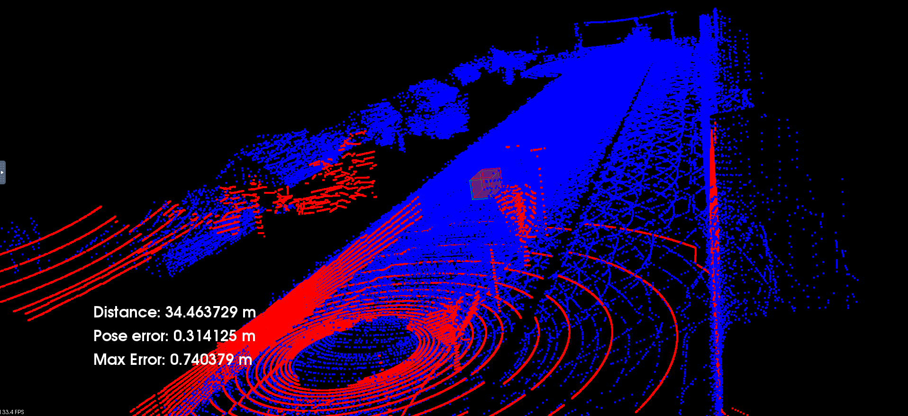
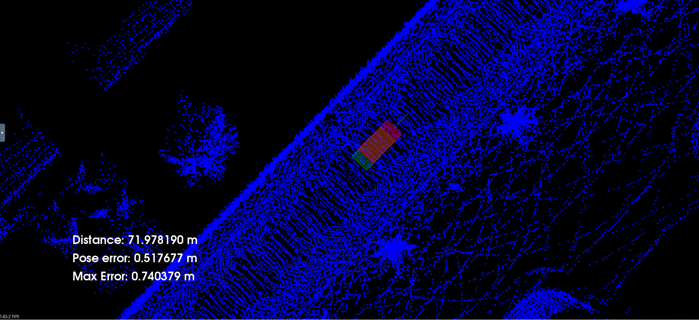
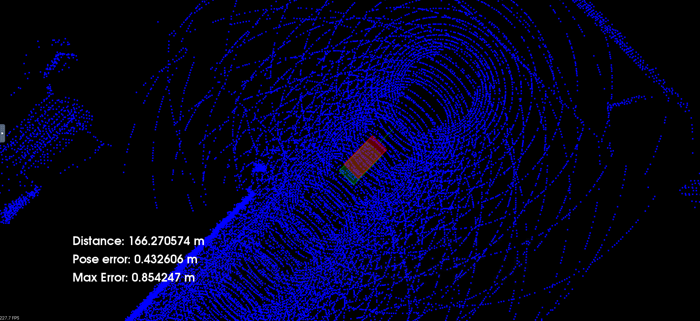
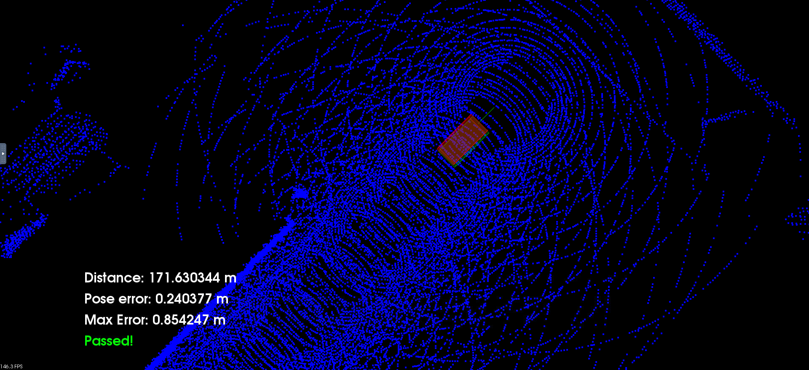
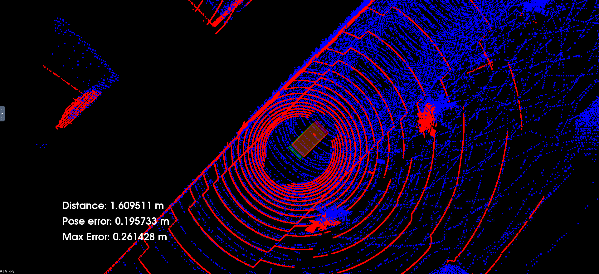
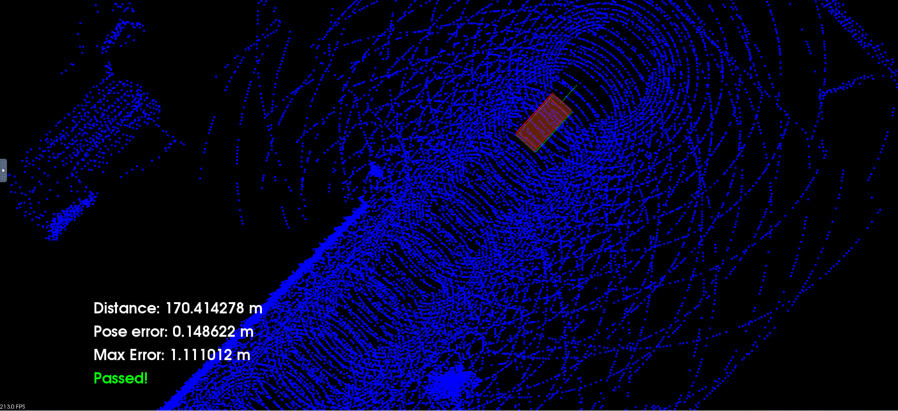

# ScanMatchingLocalization

The scan match algorithm for a self driving car using Iterative closest point (ICP) and Normal Distributions Transform (NDT) have been implemented in this project.

The pose estimation algorithm worked perfectly at that speed (3 taps of the upper arrow key) with a maximum error of 0.85m for NDT.

The pose estimation algorithm worked perfectly at that speed (3 taps of the upper arrow key) with a maximum error of 1.11m for ICP.

Overall both these algorithms worked well, but icp had a better average pose error than ndt in this given environment.
